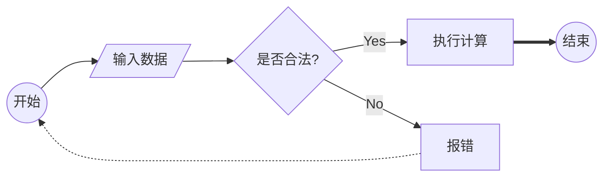
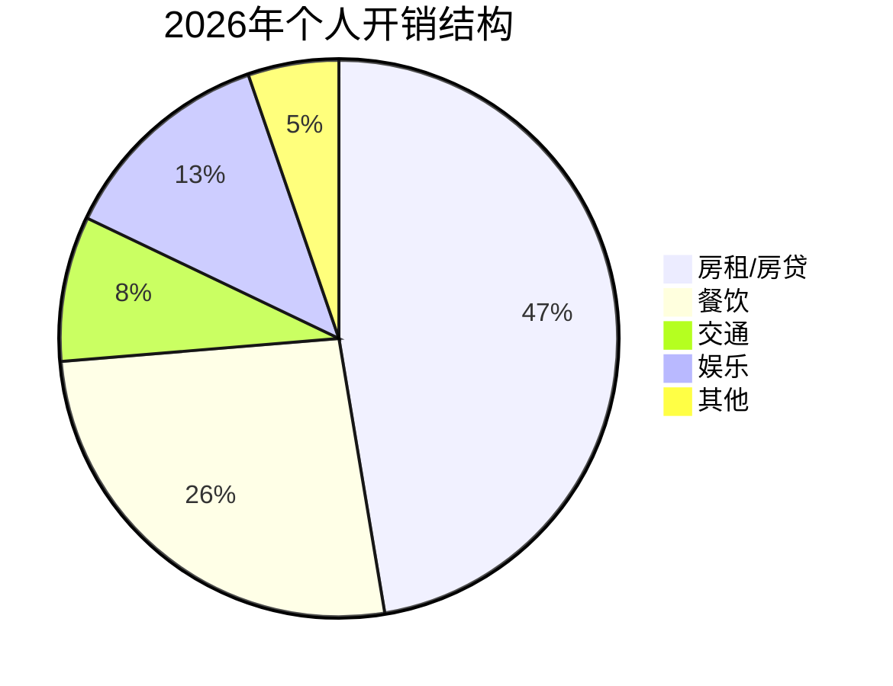
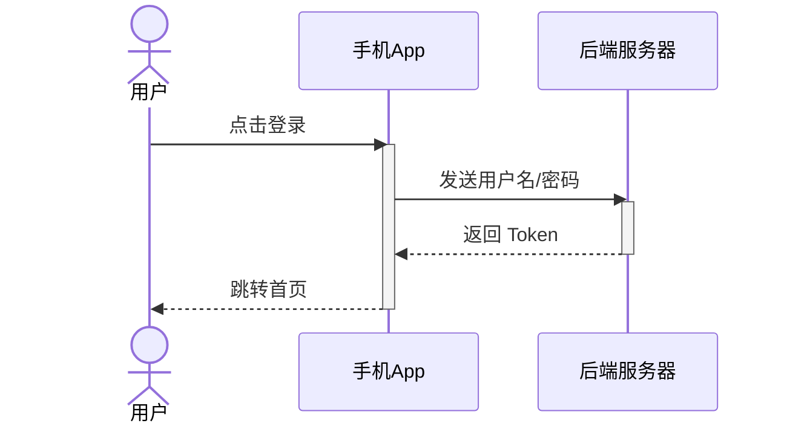
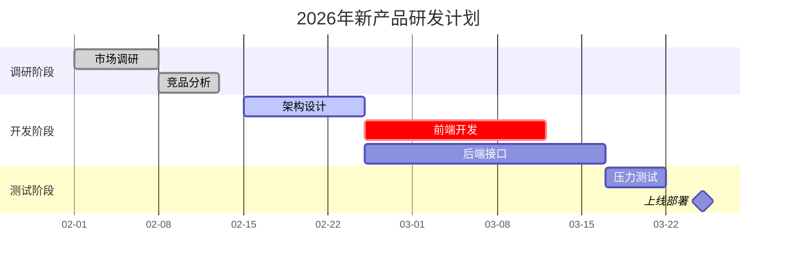

## 🚀 Mermaid 语法深度解析

### 1. 流程图 (Flowcharts) —— 逻辑处理的神器

流程图的核心在于**节点形状**和**连线样式**。

- **节点形状定义：**
  - `ID[文字]`：矩形（默认）
  - `ID(文字)`：圆角矩形
  - `ID{文字}`：菱形（判断条件）
  - `ID((文字))`：圆形
- **连线样式：**
  - `-->`：实线箭头
  - `---`：实线无箭头
  - `-.->`：虚线箭头
  - `==>`：加粗箭头

**代码示例：**

------

### 2. 饼图 (Pie Charts) —— 数据占比直观呈现

饼图的语法最简单，主要用于快速展示分类比例。

**代码示例：**

------

### 3. 时序图 (Sequence Diagrams) —— 搞定交互逻辑

时序图是开发者的最爱，用来描述系统间、人与系统间的通信非常精准。

- **参与者：** 使用 `participant` 定义，或用 `actor` 定义人。
- **消息：** `->>` (实线箭头), `-->>` (虚线返回箭头)。
- **激活：** `activate` 和 `deactivate` 可以显示生命周期柱状条。

**代码示例：**

------

### 4. 甘特图 (Gantt Charts) —— 项目进度的时间轴

甘特图最关键的是定义日期格式、任务名称、状态（如已完成、活动中）以及持续时间。

**核心语法要素：**

- `title`：图表标题。
- `dateFormat`：定义日期的输入格式（如 `YYYY-MM-DD`）。
- `section`：划分不同的项目阶段。
- `任务定义`：`任务名 :状态, 标识符, 开始时间, 结束时间/持续时长`。
  - `done`：已完成
  - `active`：正在进行
  - `crit`：关键任务（显示为红色）
  - `after [id]`：紧跟在某个任务之后开始

**代码示例：**

